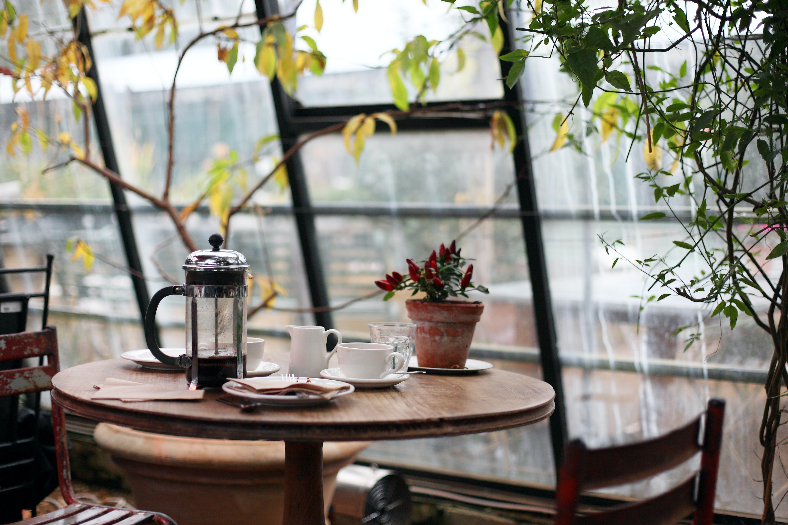

# The Garden Café ☕ 🍽

Welcome to [The Garden Café](https://enghussam23.github.io/my-restaurant/)!

 Our restaurant offers a peaceful oasis where you can enjoy delicious food and drinks, surrounded by lush greenery. Our menu is carefully crafted using only the freshest ingredients to provide you with a unique dining experience. The restaurant boasts a natural and green environment, with live plants and trees throughout the space, as well as outdoor seating. Our casual and relaxed atmosphere is the perfect setting to enjoy good food, drinks, and conversation.

## **Snapshots**

Looking for a great spot to hang out with friends? Look no further! Whether you prefer indoor or outdoor seating, we have the perfect place for you. Come and enjoy a refreshing drink in a beautiful and welcoming environment. Check out some snapshots of our space below!

- A lovely **Two Guns Espresso** drink:

    

- Indoor Seating:

    
    
    
    

- Outdoor Seating Walkway:

    

- Outdoor Seating:

    
    

## **Menu**

At [The Garden Café](https://enghussam23.github.io/my-restaurant/), we offer a variety of delicious dishes made with fresh and locally sourced ingredients. Our menu features:

<table border='2'>
    <tr>
        <th>
            Dish Type
        </th>
        <th>
            Dish Name
        </th>
        <th>
            Description
        </th>
        <th>
            Price (JD)
        </th>
    </tr>
    <tr>
        <td rowspan='6'>
            The Garden Café Specials
        </td>
        <td>
            Grilled Chicken Salad
        </td>
        <td>
            Grilled chicken breast on a bed of mixed greens with tomatoes, cucumbers, and red onions, served with balsamic vinaigrette dressing
        </td>
        <td>
            9.10
        </td>
    </tr>
    <tr>
        <td>
            Garden Veggie Sandwich
        </td>
        <td>
            Sourdough bread with fresh avocado, lettuce, tomato, cucumber, and red onion, served with a side of sweet potato fries
        </td>
        <td>
            7.70
        </td>
    </tr>
    <tr>
        <td>
            Wild Mushroom Risotto
        </td>
        <td>
            Creamy risotto with wild mushrooms, spinach, and parmesan cheese
        </td>
        <td>
            10.50
        </td>
    </tr>
    <tr>
        <td>
            Pan-Seared Salmon
        </td>
        <td>
            Fresh Atlantic salmon served with roasted potatoes, grilled asparagus,  and lemon butter sauce
        </td>
        <td>
            13.30
        </td>
    </tr>
    <tr>
        <td>
            Classic Cheeseburger
        </td>
        <td>
            Grass-fed beef patty with cheddar cheese, lettuce, tomato, onion, and pickles on a brioche bun, served with French fries
        </td>
        <td>
            8.40
        </td>
    </tr>
    <tr>
        <td>
            Margherita Pizza
        </td>
        <td>
            Fresh mozzarella cheese, sliced tomatoes, and basil on a crispy thin crust
        </td>
        <td>
            9.80
        </td>
    </tr>
    <tr>
        <td rowspan='4'>
            Apetizers
        </td>
        <td>
            Bruschetta
        </td>
        <td></td>
        <td>
            6.30
        </td>
    </tr>
    <tr>
        <td>
            Fried Calamari
        </td>
        <td></td>
        <td>
            9.10
        </td>
    </tr>
    <tr>
        <td>
            Spring Rolls
        </td>
        <td></td>
        <td>
            7.00
        </td>
    </tr>
    <tr>
        <td>
            Caprese Salad
        </td>
        <td></td>
        <td>8.40</td>
    </tr>
    <tr>
        <td rowspan='3'>
            Entrees
        </td>
        <td>
            Garden Burger
        </td>
        <td></td>
        <td>
            9.80
        </td>
    </tr>
    <tr>
        <td>
            Grilled Chicken with Roasted Vegetables
        </td>
        <td></td>
        <td>
            12.60
        </td>
    </tr>
    <tr>
        <td>
            Fish and Chips
        </td>
        <td></td>
        <td>
            11.20
        </td>
    </tr>
    <tr>
        <td rowspan='4'>
            Desserts
        </td>
        <td>
            Chocolate Cake
        </td>
        <td></td>
        <td>
            5.60
        </td>
    </tr>
    <tr>
        <td>
            Tiramisu
        </td>
        <td></td>
        <td>
            6.30
        </td>
    </tr>
    <tr>
        <td>
            Apple Pie
        </td>
        <td></td>
        <td>
            4.90
        </td>
    </tr>
    <tr>
        <td>
            Cheesecake
        </td>
        <td></td>
        <td>
            6.30
        </td>
    </tr>
</table>

## **Wireframe**

- Home Page:

    

- About Us Page:

    

- Contact Us Page:

    

## **Feedback**

Please feel free to contact me at [Hussam-Alraggad](mailto:engraggad60@gmail.com) for any feedback or advice.
